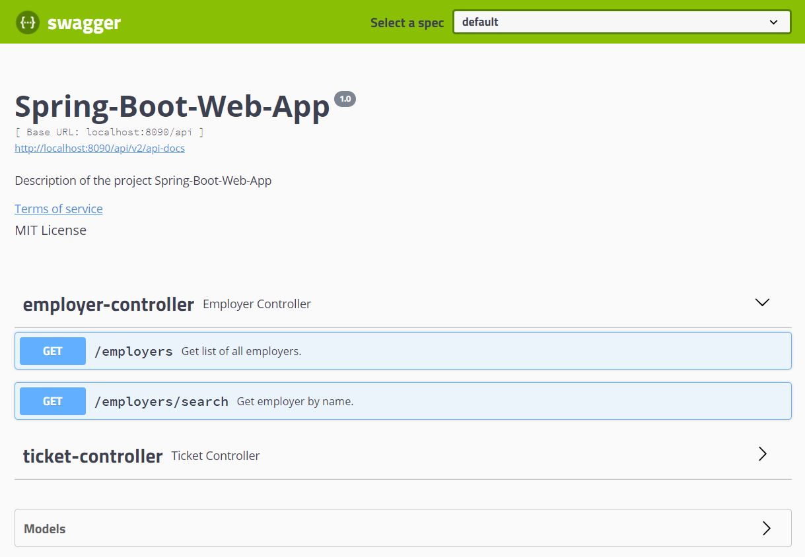

"# Spring-Boot-Web-App" 

[](https://travis-ci.org/medJarray/Spring-Boot-Web-App)

[](https://sonarcloud.io/dashboard?id=com.springApp%3Aspring5webapp)


## Documenting REST API with Swagger

To properly document the available endpoints in your REST API, which endpoints there are, what they can do, what they need as input parameters and what they will provide as output. A popular standard, that is used for this, is Swagger.

After running the application, go to http://localhost:8090/api/swagger-ui.html. If you see a blank screen, you might have to refresh once, but normally you’ll see a screen like this:



## Spring Boot REST Internationalization

Let's make simple requests using CURL:
```console
$ curl -X GET "http://localhost:8090/api/employers/search?name=toto" -H "accept: application/json" -H  "Accept-Language: fr"
On peut pas trouver l emplyeur toto
```
```console
$ curl -X GET "http://localhost:8090/api/employers/search?name=toto" -H "accept: application/json" -H  "Accept-Language: en"
Could not find employee toto
```
```console
$ curl -X GET "http://localhost:8090/api/employers/search?name=toto" -H "accept: application/json"
On peut pas trouver l emplyeur toto
```
So as you see, responses are different based on value of “Accept-Language” header passed in the request. This way, we don’t need to check what was passed in the request in each controller method, and then pass it further to service layers. We now can do this in one single place, which is CustomLocaleResolver class.